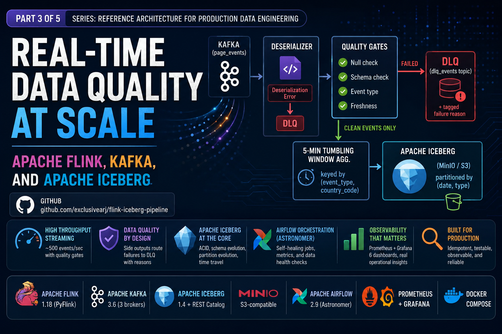

# flink-iceberg-pipeline



> Production-style Flink streaming pipeline with inline data quality gates, an Apache Iceberg sink on MinIO, and Airflow orchestration on top.

This is **Project 1** in the data engineering portfolio. It demonstrates PyFlink DataStream API + side-output DLQ patterns, Iceberg schema evolution + time travel, exactly-once checkpointing, Prometheus/Grafana observability, and Airflow lifecycle/maintenance/health DAGs.

## Stack

| Component | Technology |
|---|---|
| Stream processor | Apache Flink 1.18 (PyFlink) |
| Message broker | Apache Kafka 3.5 (Confluent Platform 7.5, single broker; 3 partitions, 2 topics) |
| Object storage | MinIO (S3-compatible) |
| Table format | Apache Iceberg 1.5.2 |
| Catalog | Iceberg REST catalog (`tabulario/iceberg-rest`) |
| Observability | Prometheus + Grafana |
| Orchestration | Astronomer Airflow 3.1 (Astro Runtime 3.1-5) |
| Data quality | [`pipeline-observe`](vendor/) — vendored wheel |

## Architecture

```
event-generator ──▶ kafka(page_events) ──▶ Flink job ─┬─[DLQ side out]──▶ kafka(dlq_events)
                                                      │
                                                      └─[main]─▶ 5min tumbling window
                                                                       │
                                                                       ▼
                                                              Iceberg page_events_aggregated
                                                              (MinIO/warehouse)
```

Inline quality gates inside the Flink ProcessFunction:
1. **null fields** — `user_id`, `event_type`, `timestamp_ms` must not be null/empty
2. **schema** — `timestamp_ms` must be `int`; `duration_ms` must be `int >= 0` if present
3. **event_type** — must be one of 7 allowed values
4. **device_type** — must be one of 4 allowed values
5. **freshness** — `timestamp_ms` must be within `[now-24h, now+60s]`

First failing gate routes the raw payload + reason to the DLQ.

## One-command bring-up

```bash
docker compose up -d
```

Brings up: zookeeper, kafka, kafka-init, kafka-ui, minio, minio-init, iceberg-rest, flink-jobmanager, flink-taskmanager, event-generator, prometheus, grafana, plus the Airflow stack (postgres, airflow-init, webserver, scheduler).

**UIs:**
- Flink:     <http://localhost:8081>
- Kafka UI:  <http://localhost:8080>
- MinIO:     <http://localhost:9001>  (minioadmin / minioadmin)
- Grafana:   <http://localhost:3000>  (admin / admin)
- Airflow:   <http://localhost:8082>  (admin / admin)
- Prometheus:<http://localhost:9090>

## Workflow

```bash
make up                        # full stack
make submit                    # submit PyFlink job via the Flink CLI inside the container
make logs                      # tail Flink JM+TM logs

# After a few minutes, time-travel demo:
make query                     # python iceberg/query_time_travel.py (auto-creates .venv)

make test                      # unit tests, schemas/gates/sink DDL (auto-creates .venv)
make down                      # tear down + delete volumes
```

`make test`, `make query`, and `make venv` all bootstrap a local Python 3.11 virtualenv at `.venv/` on first use via a observe file at `.venv/.deps-installed`. Subsequent calls are cached. Run `make clean` (or `rm -rf .venv`) to force a full rebuild — useful if the venv was left in a stale state. Override the interpreter with `PYTHON=python3.x make ...` if 3.11 is unavailable.

## Airflow

4 DAGs orchestrate this stack:

| DAG | Schedule | Purpose |
|---|---|---|
| `p1_pipeline_controller` | manual | wait for Kafka+MinIO+Flink → init Iceberg → submit Flink job → store job_id |
| `p1_iceberg_maintenance` | `0 2 * * *` | compact `page_events_aggregated` → expire snapshots > 7d → validate (using `pipeline-observe`) → annotate Grafana |
| `p1_dlq_monitor` | `0 * * * *` | sample DLQ topic → count reasons → alert Slack if DLQ rate > 5% |
| `p1_health_report` | `30 8 * * *` | aggregate Flink + Kafka + Iceberg metrics into a daily summary |

See [airflow/](airflow/) for the Astronomer scaffold.

## Troubleshooting `make up`

A clean `make up` builds three local images (`flink-jobmanager`, `event-generator`, `airflow-*`). On Apple Silicon / arm64 the build has a few non-obvious requirements that are baked into the Dockerfiles — documented here so they don't get accidentally reverted:

- **Airflow image — vendored `observe` wheel.** Astro Runtime auto-installs `airflow/requirements.txt` via an ONBUILD hook, so the wheel must *not* be listed there (a relative path can't be resolved during ONBUILD). Instead `airflow/Dockerfile` COPYs `pipeline_observe-*.whl` to `/tmp/` and installs it as an explicit `pip install` argument.
- **Airflow image — `build-essential`.** `pyiceberg[s3]==0.5.1` (needed by the DAGs) pulls `mmhash3`, which has no arm64 wheel and compiles from source. `airflow/packages.txt` lists `build-essential` so Astro installs the compiler before pip runs.
- **Flink image — JDK headers + `g++`.** `apache-flink==1.18.0` pulls `pemja`, which has no arm64 wheel and needs `g++` plus JNI headers. The `flink:1.18` base ships only a JRE, so `flink_job/Dockerfile` installs `openjdk-11-jdk-headless` and symlinks its `include/` to `/opt/java/openjdk/include` (where `pemja` looks).
- **Iceberg connector version.** `iceberg-flink-runtime-1.18` was first published at **1.5.0**, so `flink_job/Dockerfile` pins `ICEBERG_VER=1.5.2` (the 1.4.x line has no Flink 1.18 runtime).
- **Postgres port in the Airflow DB URL.** `AIRFLOW__DATABASE__SQL_ALCHEMY_CONN` must include `:5432` (`...@postgres:5432/airflow`). The Astro entrypoint parses the port out of this URL to wait for Postgres with `nc`; omit it and the webserver/scheduler/dag-processor hang on `nc: port number invalid` forever (`airflow-init` is unaffected because it overrides the entrypoint).

## Troubleshooting `make submit`

`make submit` runs `flink run -py /opt/flink_job/job.py` inside the JobManager. Several non-obvious requirements are baked into `flink_job/Dockerfile` and `docker-compose.yml` so the job submits, runs, and checkpoints cleanly — documented here so they don't get reverted:

- **`PYTHONPATH` points at the package parent.** The PyFlink modules import each other as the `flink_job` package (`from flink_job.schemas import ...`), so the package's **parent** must be on the path, not the package dir. `flink_job/Dockerfile` sets `ENV PYTHONPATH=/opt` (code is copied to `/opt/flink_job/`) and `job.py` does `sys.path.insert(0, "/opt")`. Pointing either at `/opt/flink_job` makes `flink run` fail with `ModuleNotFoundError: No module named 'flink_job'` on both the JobManager and the TaskManager Python worker.
- **Flink-SQL DDL: no `IF NOT EXISTS` on `CREATE CATALOG`, and quote `default`.** Flink 1.18's parser rejects `CREATE CATALOG IF NOT EXISTS` (it reads `IF` as the catalog name). `default` is a reserved word and must be backtick-quoted as a database name. `flink_job/sinks.py` uses `CREATE CATALOG {name}` and `` `default` `` accordingly.
- **Hadoop classes for the Iceberg catalog.** Flink's Iceberg connector instantiates a Hadoop `Configuration` during catalog init even for a REST catalog + S3FileIO, but the `flink:1.18` base ships no Hadoop. `flink_job/Dockerfile` adds `flink-shaded-hadoop-2-uber` to `/opt/flink/lib`; without it `CREATE CATALOG` throws `ClassNotFoundException: org.apache.hadoop.conf.Configuration`.
- **PyFlink `ProcessFunction` method name + side-output API.** The quality-gate function must override `process_element` (snake_case) — Java-style `processElement` leaves the class abstract (`Can't instantiate abstract class ... with abstract method process_element`). Side outputs are emitted by `yield output_tag, value` (the PyFlink `Context` has no Java-style `ctx.output()`).
- **Memory sizing for a ~6 GiB Docker VM.** PyFlink spawns one Beam Python worker per task slot, each loading pandas/pyarrow outside the JVM heap. With the full 14-service stack resident, four slots OOM-kill the TaskManager (exit 137). The job is pinned to `PARALLELISM=1` (JobManager env, read by `job.py`), `taskmanager.numberOfTaskSlots: 1`, and `taskmanager.memory.process.size: 1280m`. Give Docker more memory to raise these.
- **Filesystem checkpoint storage.** The job enables exactly-once checkpointing, but the default JobManager in-memory storage caps state at 5 MB — the Kafka-source + window state exceeds it, so every checkpoint fails (`Size of the state is larger than the maximum permitted memory-backed state`) and the job eventually restart-loops. Both Flink services set `state.checkpoints.dir: file:///opt/flink/checkpoints` (which selects `FileSystemCheckpointStorage`) backed by a shared `flink-checkpoints` named volume.
- **AWS region for the Iceberg S3FileIO.** The Iceberg connector writes data files to MinIO through the AWS SDK v2, which requires a region even for an S3-compatible endpoint. The `flink-jobmanager` and `flink-taskmanager` containers set `AWS_REGION=us-east-1` (matching `iceberg-rest`). Without it the job runs but every checkpoint's Iceberg commit throws `SdkClientException: Unable to load region from any of the providers in the chain`, the job restart-loops replaying the same offsets, and **no snapshots are ever committed** (so the table stays empty and `make query` has nothing to read).

## Troubleshooting `make query`

`make query` runs `iceberg/query_time_travel.py` in the local venv against the REST catalog + MinIO.

- **pyiceberg 0.5.1 snapshot API.** Snapshots are a list at `table.metadata.snapshots` — there is no `Table.snapshots()` method in 0.5.1 (calling it raises `AttributeError: 'Table' object has no attribute 'snapshots'`). Same accessor is used in `airflow/dags/utils/iceberg_ops.py`.
- **Region on the read side too.** The query venv reads data files from MinIO via pyiceberg's own S3 FileIO, so its `load_catalog(...)` config sets `s3.region`. The REST metadata fetch works over plain HTTP, but the `table.scan().to_arrow()` data read needs the region.
- **Needs ≥2 snapshots for the time-travel delta.** Each fired 5-min window commits a snapshot on the next checkpoint; give the job a few minutes after `make submit` (it also burns through the Kafka backlog on start, advancing event-time quickly) before expecting a previous-snapshot diff.

## Repository layout

```
flink-iceberg-pipeline/
├── docker-compose.yml              ← 14-service stack (core + airflow)
├── Makefile                        ← `make up`, `make submit`, `make test`, ...
├── flink_job/                      ← PyFlink job
│   ├── job.py                      ← main entry point
│   ├── quality_gates.py            ← QualityGateProcessor + 5 gate functions
│   ├── schemas.py                  ← PageEvent dataclass + JSON Schema
│   ├── sinks.py                    ← Iceberg + Kafka DLQ DDL helpers
│   ├── Dockerfile                  ← Flink 1.18 + Python + Kafka/Iceberg JARs
│   └── requirements.txt
├── generator/                      ← synthetic event producer
│   ├── generate_events.py
│   ├── Dockerfile
│   └── requirements.txt
├── iceberg/
│   ├── init_catalog.py             ← bootstrap REST catalog + raw table
│   └── query_time_travel.py        ← snapshot listing + AS OF query demo
├── prometheus/prometheus.yml
├── grafana/
│   ├── provisioning/{datasources,dashboards}/...
│   └── dashboards/pipeline_overview.json
├── tests/                          ← schemas, gates, sink DDL
├── airflow/                        ← Astronomer scaffold (Dockerfile, DAGs, utils)
└── vendor/
    └── pipeline_observe-0.1.0-py3-none-any.whl   ← vendored from Project 3
```

## Standalone vs sibling-repo development

This repo is **standalone**: `pipeline-observe` is installed from the vendored wheel under `vendor/`. To develop the library and this pipeline together, replace the wheel reference with an editable install pointing to a sibling clone:

```bash
.venv/bin/pip install -e ~/Documents/Developer/pipeline-observe
```
